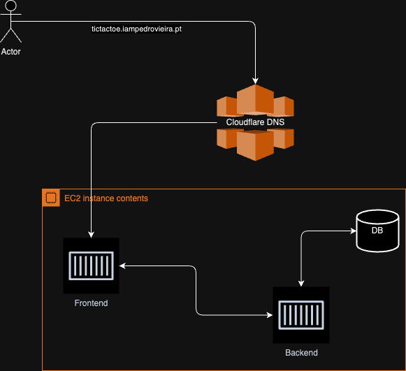

# Tic-Tac-Toe Multiplayer

## Project Overview

This repository is part of a personal project aimed at learning and exploring new technologies through the development of a multiplayer Tic-Tac-Toe game. The main focus of this project has been to explore new tools and technologies, with a particular emphasis on the Socket.io library, which was a new endeavor for me. The project is far from complete, especially the front-end, and serves as a learning platform.

The game introduces unique gameplay mechanics and is built using modern web technologies, following best practices for real-time web applications.

## Project Features

- **Multiplayer Gameplay**: Support for real-time multiplayer gaming experience.
- **Unique Game Mechanics**: 
  - **Limited Moves**: You can only use 3 positions on the board. If you play a fourth move, your first move will be automatically removed. Keep track of your opponent's moves as well!
  - **Player Limit**: Only the first 2 players to join can play the game. Anyone else who joins will be a spectator. So, get in quick!
  - **Creating a New Room**: Want to start your own game? Simply navigate to `/room/roomname` in your browser. For example, [https://tictactoe.iampedrovieira.pt/room/test](https://tictactoe.iampedrovieira.pt/room/test). Share the link with your opponent to start playing against each other.
  
  Welcome to a Unique Tic-Tac-Toe Experience! Enjoy the game, and may the best player win!

## Concept Version Available

A concept version of the game is currently live and can be accessed at [https://tictactoe.iampedrovieira.pt](https://tictactoe.iampedrovieira.pt). Please note that this version does not include the unit tests with Jest as the tests have not yet been adapted to the new database structure and dynamic room features.

## Technologies Used

- **Front-end**: React, Next.js, WebSocket
- **Back-end**: Node.js, Express.js, Sequelize, PostgreSQL
- **Deployment**: Docker, Docker Compose
- **Testing**: Jest (Note: The live version does not include Jest tests)
- **Real-Time Communication**: Socket.io

## Contributors

- **Pedro Vieira** - Initial work and development.

## License

This project is open-sourced under the MIT License. See the LICENSE file for more details.